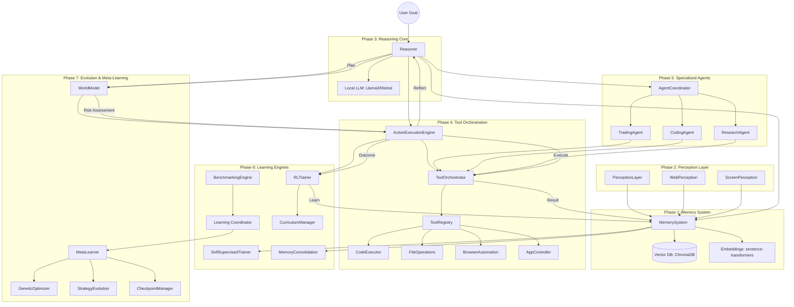

# MECOS Architectural Diagram

## Digital Organism Lifecycle
1. **Observe**: Perception layers scan files, web, and screen.
2. **Encode**: Data is converted to vector embeddings.
3. **Store**: Memories are persisted in the local vector database.
4. **Reason**: Local LLM generates plans and strategies.
5. **Act**: Tool orchestrator executes actions in a safe sandbox.
6. **Evaluate**: Benchmarking and reflection assess performance.
7. **Adapt**: Meta-learning and evolution mutate strategies for improvement.
